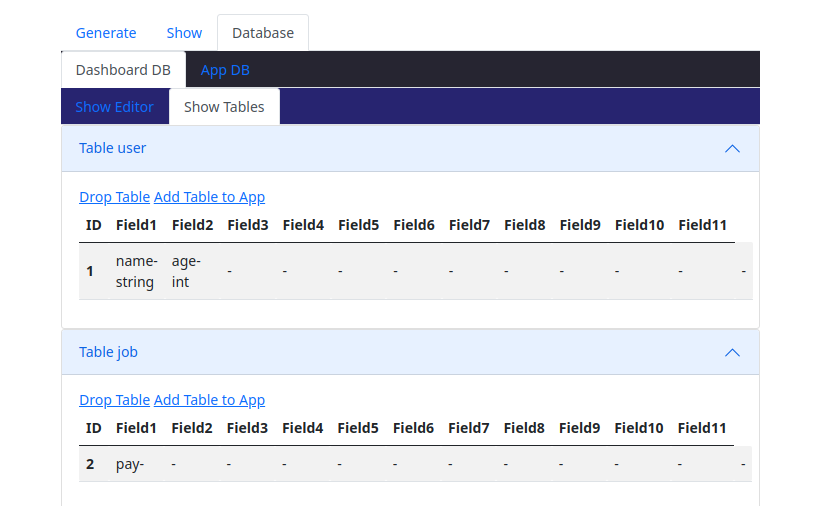
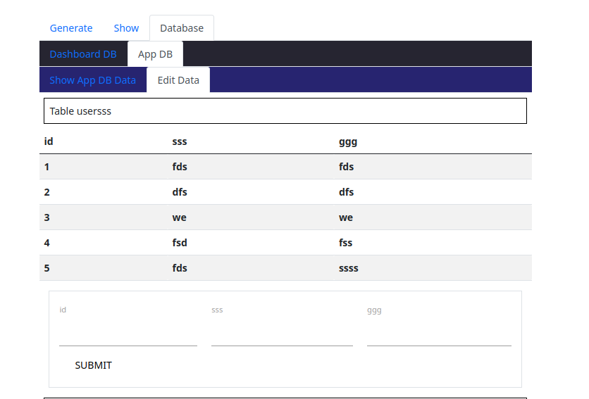

## GroundUP
* [General info](#general-info)
* [Technologies](#technologies)
* [Setup](#setup)
* [Repositoryoverview](#repositoryoverview)


## General info
This project is a dashboard that generates code for your app.

## Technologies
Project is created with:
* [modernc.org/sqlite](https://pkg.go.dev/modernc.org/sqlite)
* [go-ps](https://github.com/mitchellh/go-ps)
* [viper](github.com/spf13/cobra)
* [echo](github.com/labstack/echo/v4)
* [sprig](https://github.com/Masterminds/sprig)

## Setup
To run this project, download it and run the following

```
$ cd ../groundup
$ go run *.go
```




## Repositoryoverview

Provide an overview of the directory structure and files, for example:
```bash
├── README.md
├── app
├── src
│   ├── dashboard
│   └── templates
├── pkg/utility
    ├── cli
    ├── general
    ├── generate
    └── handler
├── internal
    ├── dbsql
    └── generate
└── cmd 
```
My walkthrough of the project [Youtube](https://www.youtube.com/watch?v=bwti-IZ5mUE).

<h1 align="center">Hi 👋, I'm Zachary Endrulat</h1>
<h3 align="center">I love Go</h3>

<p align="left">  </p>

- 🔭 I’m currently working on [groundup](https://github.com/golangast/groundup)

- 🌱 I’m currently learning **Go echo**

- 👯 I’m looking to collaborate on [groundup](https://github.com/golangast/groundup)

- 🤝 I’m looking for help with [groundup](https://github.com/golangast/groundup)

- 👨‍💻 All of my projects are available at [https://endrulats.com/?page_id=149](https://endrulats.com/?page_id=149)

- 📝 I regularly write articles on [https://medium.com/@snippet22/errors-in-go-1ebfa1c1b883](https://medium.com/@snippet22/errors-in-go-1ebfa1c1b883)

- 💬 Ask me about **Golang**

- 📫 How to reach me **zendrulat@gmail.com**

- 📄 Know about my experiences [https://bit.ly/3zY8SNw](https://bit.ly/3zY8SNw)

- ⚡ Fun fact **I enjoy Go too much**

### Blogs posts
<!-- BLOG-POST-LIST:START -->
<!-- BLOG-POST-LIST:END -->

<h3 align="left">Connect with me:</h3>
<p align="left">
<a href="https://medium.com/@zachary endrulat" target="blank"></a>
<a href="https://www.youtube.com/c/https://www.youtube.com/channel/uchjlaqtcdln_bjux-1_cpmg" target="blank"></a>
</p>

<h3 align="left">Languages and Tools:</h3>
<p align="left"> <a href="https://getbootstrap.com" target="_blank" rel="noreferrer">  </a> <a href="https://www.w3schools.com/css/" target="_blank" rel="noreferrer">  </a> <a href="https://golang.org" target="_blank" rel="noreferrer">  </a> <a href="https://www.w3.org/html/" target="_blank" rel="noreferrer">  </a> <a href="https://developer.mozilla.org/en-US/docs/Web/JavaScript" target="_blank" rel="noreferrer">  </a> <a href="https://www.mysql.com/" target="_blank" rel="noreferrer">  </a> </p>

<h3 align="left">Support:</h3>
<p><a href="https://ko-fi.com/zacharyendrulat98451"> </a></p><br><br>


Special thanks to the following groups/people.
-
Go Team because they are gods. 
-
gods - https://github.com/golang/go/graphs/contributors
-
Creator of go echo - https://github.com/labstack/echo/v4
-
members https://github.com/labstack/echo/graphs/contributors
-
Creator of go Viper - https://github.com/spf13/viper 
-
members https://github.com/spf13/viper/graphs/contributors
-
Creator of sqlite and the go sqlite - https://modernc.org/sqlite 
-
members - https://gitlab.com/cznic/sqlite/-/project_members
-
Creator of go-ps - https://github.com/mitchellh/go-ps
-
members - https://github.com/mitchellh/go-ps/graphs/contributors