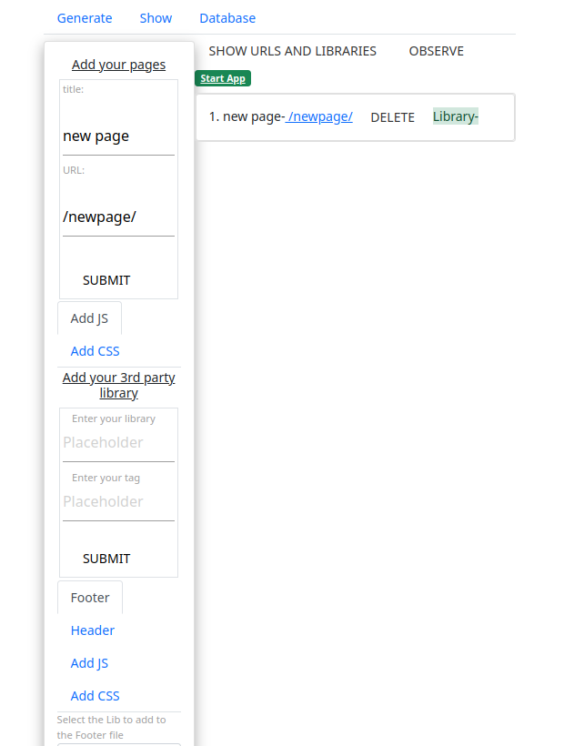

<p align="left">  </p>


 


<h3 align="left">Languages and Tools:</h3>
<p align="left"> <a href="https://getbootstrap.com" target="_blank" rel="noreferrer">  </a> <a href="https://www.w3schools.com/css/" target="_blank" rel="noreferrer">  </a> <a href="https://golang.org" target="_blank" rel="noreferrer">  </a> <a href="https://www.w3.org/html/" target="_blank" rel="noreferrer">  </a> <a href="https://developer.mozilla.org/en-US/docs/Web/JavaScript" target="_blank" rel="noreferrer">  </a> <a href="https://www.mysql.com/" target="_blank" rel="noreferrer">  </a> </p>

## GroundUP
* [General info](#general-info)
* [Why build this?](#why-build-this)
* [Technologies](#technologies)
* [Setup](#setup)
* [Repository overview](#repository-overview)
* [Special thanks](#special-thanks)


## General info
This project is a dashboard that generates code for your app.


## Why build this?
* Go never changes
* Generated Go never changes
* Go Sqlite can be put in my binary
* Poeple who either don't know Go or are lazy can just work on HTML
* I don't have to write these services again
* The app can be generated from scratch again
* It is datacentric and I am not aware of another service that is
* No need to worry about upgrades of the language that cuases conflicts
* Because everything is in a binary that generates everything you won't need as much help
* It is paralell with the schedular so the speed will scale with your code and hardware
* It is all in Go without make files so it is easy to read
*My walkthrough of the project [Youtube](https://www.youtube.com/watch?v=bwti-IZ5mUE)

## Technologies
Project is created with:
* [modernc.org/sqlite](https://pkg.go.dev/modernc.org/sqlite) - database
* [go-ps](https://github.com/mitchellh/go-ps) - getting pids in all OS's
* [viper](github.com/spf13/cobra) - build cli commands
* [echo](github.com/labstack/echo/v4) - web framework to shorten code
* [sprig](https://github.com/Masterminds/sprig) - template functions

## Setup
To run this project, download it and run the following

```
$ cd ../groundup
$ go run *.go
```
 <h1 align="center">CMS</h1>
 <p align="center">

</p>
<h1 align="center">Dashboard DB</h1>
 <p align="center">

</p>
<h1 align="center">App DB</h1>
 <p align="center">

</p>

## Repository overview
```bash
├── cmd
├── config
├── db
├── internal (services)
│   ├── dbsql
│   │   ├── appdata
│   │   ├── conn
│   │   ├── createdb
│   │   ├── datacreation
│   │   ├── deletetable
│   │   ├── gettabledata
│   │   └── pagecreation
│   └── generate
│       ├── generators
│       └── templates
├── pkg (utility functions)
│   └── utility
│       ├── cli
│       ├── general
│       ├── generate
│       └── handler
├── src (frontend)
│   ├── dashboard
│   │   ├── handler
│   │   └── routes
│   ├── db
│   ├── extra
│   ├── funcmaps (template functions)
│   ├── img
│   └── templates
│       ├── database
│       ├── generate
│       └── show
```

## Future wish list being worked on

- [ ] Transfer dashboard db to app db (in progress)
- [ ] Delete columns in app db
- [ ] List of data avaiable to templates
- [ ] Widgets
- [ ] JWT
- [ ] Autho


<h1 align="center">Hi 👋, I'm Zachary Endrulat</h1>
<h3 align="center">I love Go</h3>

- 🔭 I’m currently working on [groundup](https://github.com/golangast/groundup)

- 🌱 I’m currently learning **Go echo**

- 👯 I’m looking to collaborate on [groundup](https://github.com/golangast/groundup)

- 🤝 I’m looking for help with [groundup](https://github.com/golangast/groundup)

- 👨‍💻 All of my projects are available at [https://endrulats.com/?page_id=149](https://endrulats.com/?page_id=149)

- 📝 Articles I write about Go [https://medium.com/@snippet22/errors-in-go-1ebfa1c1b883](https://medium.com/@snippet22/errors-in-go-1ebfa1c1b883)

- 💬 Ask me about **Golang**

- 📫 How to reach me **zendrulat@gmail.com**

- Resources that I use [Resources](https://docs.google.com/document/d/1Zb9GCWPKeEJ4Dyn2TkT-O3wJ8AFc-IMxZzTugNCjr-8/edit?usp=sharing)

- ⚡ Fun fact **I enjoy Go too much**

 
 
<h3 align="left">Support:</h3>
<p><a href="https://ko-fi.com/zacharyendrulat98451"> </a></p><br><br>


## Special thanks
* [Go Team because they are gods](https://github.com/golang/go/graphs/contributors)
* [Creators of go echo](https://github.com/labstack/echo/graphs/contributors)
* [Creators of go Viper](https://github.com/spf13/viper/graphs/contributors)
* [Creators of sqlite and the go sqlite](https://gitlab.com/cznic/sqlite/-/project_members)
* [Creator of go-ps ](https://github.com/mitchellh/go-ps/graphs/contributors)